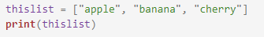
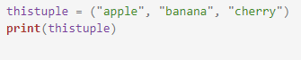
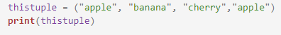
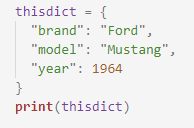

 <h3>Data Types</h3>
                     Before starting with arrays you must know the concept of mutability.
An object may be classified into two categories : 
i. Mutable 
ii. Immutable 

Mutable are those objects whose value can be altered after assigning a particular value.
Immutable are those objects whose value can not be altered after assigning of a value. 
List And Dictionary are Mutable. 
Tuples are Immutable.  

<h3>Data Type Character</h3>
i.List Mutable 
ii.Tuple Immutable 
iii.Dictionary Mutable 
                    <h4>LIST</h4>It is a collection of data in which date is stored in ordered form. 
                    Syntax : object_name = [ elements ] 
                    The above mentioned syntax is of list where the elements are mentioned in square brackets.  
                    Program: 
                     
                    Output 
                    ['apple', 'banana', 'cherry']  
                    <h4>Tuple</h4>A tuple is a collection of data which is mostly similar to a list except that it is immutable i.e. the value once stored in a tuple cannot be changed. Though tuple allows concatenation.
                    Syntax : object_name = ( elements )  
                    This is the syntax of a tuple, where elements are placed under parenthesis.  
                    Program: 
                      
                    Output: 
                    ('apple', 'banana', 'cherry')  
                    Tuples allow duplicate values: 
                    Program: 
                      
                    Output: 
                    ('apple', 'banana', 'cherry','apple') 
 <h4>Dictionary</h4>Dictionary is a collection of data which is not sequential like a list, thus indexing is not possible.
It consists of a key and its value. 
Example : dict1 = {1 : "Red", 2 : "Blue", 3 : "Green"} 
The above syntax is for a dictionary where the elements are placed under curly brackets. 
Program:  
  
Output:  
{'brand': 'Ford', 'model': 'Mustang', 'year': 1964}
